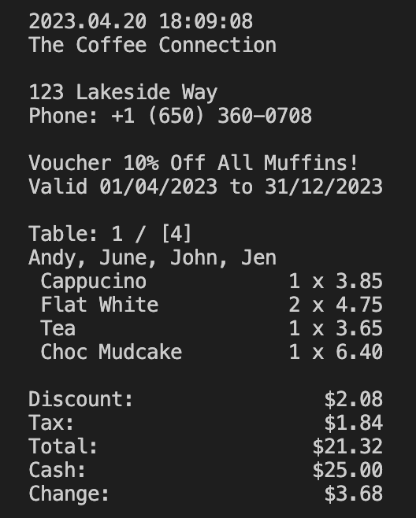
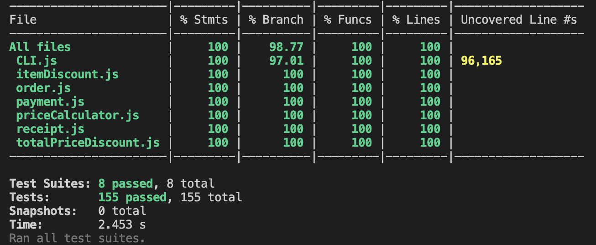

# Cafe Till - JS, OOP and TDD

## About this project
This is a test-driven JavaScript program that operates as a till for a cafe, processing orders and printing receipts. It contains a series of classes that adhere to OOP principles, as well as a procedural command-line interface class which interacts with the other classes, and which staff can use to process orders.

## Functionality
This program handles:
- The creation of orders (entering a table number and the name(s) of the customer(s))
- The addition, removal and viewing of menu items
- The cancellation of orders
- The addition of discounts for specific items (e.g., 10% off Americanos)
- The addition of discounts for the total bill (e.g., 5% off orders over $20)
- Calculating discounts, tax and the total bill
- Payments and change
- Printing receipts

## Specification
### Sample receipt

```
2023.04.17 16:42:45
The Coffee Connection

123 Lakeside Way
Phone: +1 (650) 360-0708

Voucher 10% Off All Muffins!
Valid 01/04/2023 to 31/12/2023

Table: 1 / [4]
Andy, June, John, Jen
  Cappucino            1 x 3.85
  Flat White           2 x 4.75
  Tea                  1 x 3.65
  Choc Mudcake         1 x 6.40

Discount:                $2.08
Tax:                     $1.84
Total:                  $21.32
Cash:                   $25.00
Change:                  $3.68
```

### Requirements
Here are the requirements I tasked myself with fulfilling:

### Sprint 1
Implement a system that contains the business logic to produce receipts similar to the one above, using a json menu (see cafeMenu.json).

Receipts must calculate and show the correct amount of tax (in this shop's case, 8.64%), as well as correct line totals and total amount. Don't worry about calculating discounts or change yet.

### Sprint 2
Add functionality to handle discounts - both discounts for selected items (e.g., 5% off Tea) and on orders over a certain total value (e.g., 10% off orders over $20).
Add functionality to take payment and calculate correct change.

### Sprint 3
Implement a command-line interface so that members of staff can use the till.

## Structure and approach
I employed a strict TDD approach for this challenge, committing after each passing test and each refactor. Approximately 100% test coverage from 155 tests was achieved. I focused on following OOP principles (such as encapsulation and abstraction), the single-responsibility principle, and class decoupling, ensuring that my unit tests mocked other classes. The only exception to this is the CLI class, for which I took more of a procedural approach.

## How to install the code
1. If not already installed: Install Node Version Manager (NVM): ```brew install nvm```
2. If not already installed: Install Node.js (I used v19.4.0): ```nvm install 19```
3. Clone the repository to your device
2. Enter the directory: ```cd cafe-till```
3. Activate Node: ```nvm use node```
4. Run ```npm install```

## How to run the code
1. Enter the directory: ```cd cafe-till```
2. Run ```node cli.js```
3. Enjoy!

## How to run tests on the code
1. Run ```npx jest```
2. For test coverage, run ```npx jest --coverage```

## Screenshots
#### The program producing a receipt the same as the sample (but with the current date)



#### All 155 tests passing with c. 100% coverage

